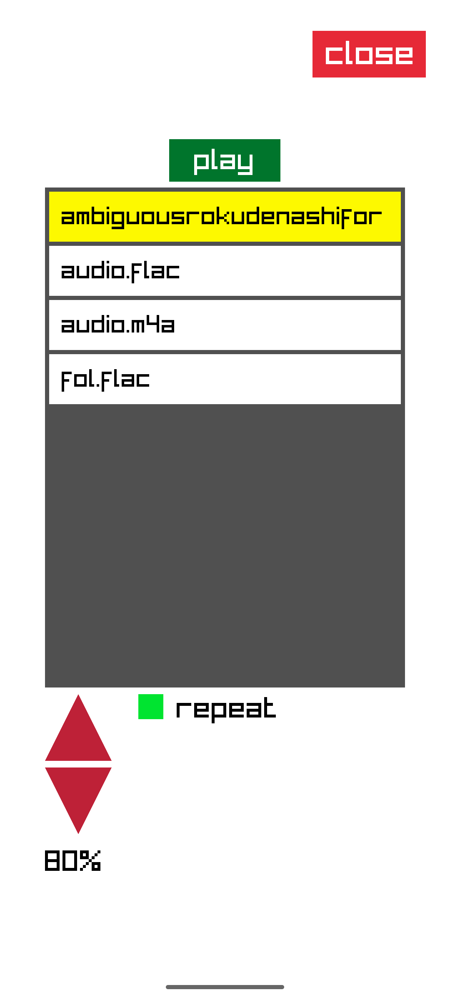

# Native C Audio Player (NCAP)

A lightweight, minimal, and (hopefully) battery-saving audio player for Android, written in pure C.

## Usage

Grant NCAP media access permissions (from app info in settings).

Place your audio tracks in the path specified by `NCAP_DEFAULT_TRACK_PATH` found in `properties.h`,
which defaults to `/sdcard/Music/NCAP-share`, which assumes that `/sdcard` is your home directory.
This directory can be changed (with caution).

NCAP sorts your tracks lexicographically, so prefix each of your tracks with a number according to the order in which the tracks should be played.

##### File Types

The following audio codecs have been tested to work with NCAP:

| Codec                            | Extension |
| -------------------------------- | --------- |
| Waveform Audio                   | `.wav`    |
| MP3                              | `.mp3`    |
| MPEG-4 Audio                     | `.m4a`    |
| OPUS                             | `.opus`   |
| Free Lossless Audio Codec (FLAC) | `.flac`   |

Please submit an issue if you encounter a codec that breaks.

### Dependencies

- [raylib](https://github.com/raysan5/raylib) (tested on `>=5.5`)
- [FFmpeg](https://github.com/FFmpeg/FFmpeg) `>=7.0`
    - `libavutil`
    - `libavformat`
    - `libavcodec`

### Supported ABIs

See the [supported ABIs](https://developer.android.com/ndk/guides/abis#sa) page on the Android NDK documentation.

- `armeabi-v7a` (ARM)
- `arm64-v8a` (AArch64)
- `x86_64` (x86-64)

TODO: support x86 (libav compile issues)

### Image

